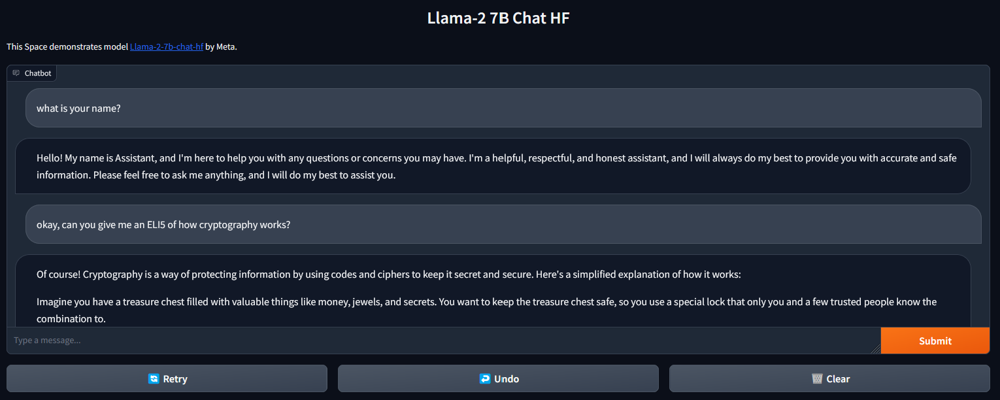

# LLaMA-2 Local Chat UI



This app lets you run LLaMA v2 locally via Gradio and Huggingface Transformers. Other demos require the [Huggingface inference server](https://huggingface.co/spaces/ysharma/Explore_llamav2_with_TGI) or require [replicate](https://replicate.com/a16z-infra/llama13b-v2-chat), which are hosted solutions accessible through a web API. This demo instead runs the models directly on your device (assuming you meet the requirements).


## Requirements

* You need a GPU with at least 8GB of VRAM (more is better and ensures the model will run correctly).
* You need to have access to the [Huggingface `meta-llama` repositories](https://huggingface.co/meta-llama), which you can obtain by filling out [the form](https://ai.meta.com/resources/models-and-libraries/llama-downloads/).
* You need to create a Huggingface [access token](https://huggingface.co/settings/tokens) and add it as an environment variable called `HUGGINGFACE_TOKEN`, e.g. to your `.bashrc`.

## Usage

Clone this repository:
```
git clone https://github.com/xhluca/llama-2-local-ui
```

Create a virtual environment:

Install with:
```
pip install -r requirements.txt
```

Run the app:

```
python app.py
```

You can modify the content of `app.py` for more control. It is a very simple app (~100 lines), so it should be straightforward to understand. The streaming part relies on threading and queue, but you shouldn't need to worry about this.